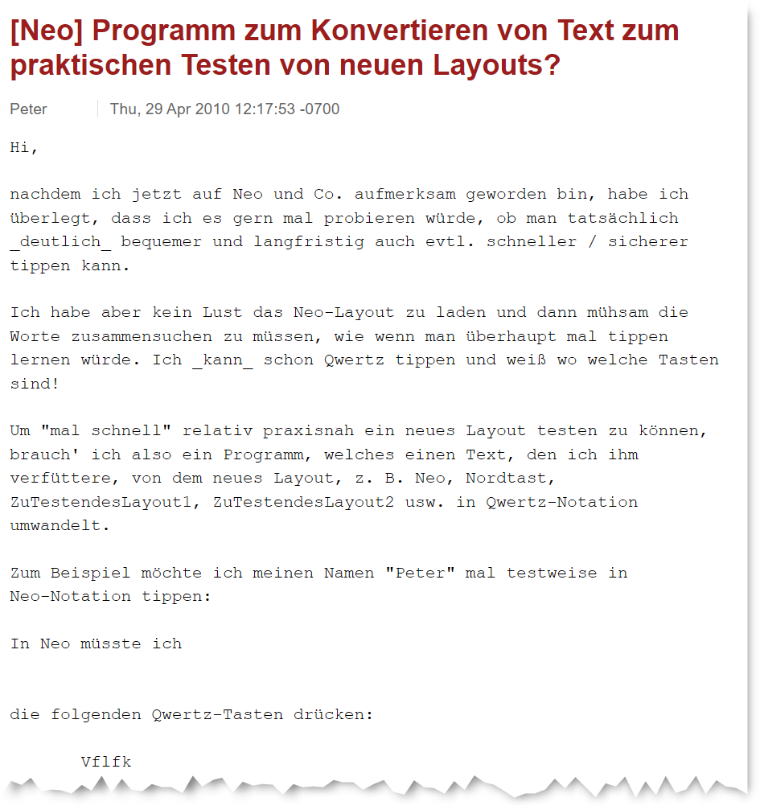

Switching keyboard layouts is a significant investment. Weeks of reduced productivity, relearning muscle memory built over years, and the possible friction of keyboard shortcuts that behave unexpectedly are real costs. The last thing you want is to spend two months learning a layout only to discover that it does not actually feel more comfortable for *your* hands typing *your* most common words.

The usual approach is to pick a layout based on analyzer statistics, start practicing on typing trainers, and then hope you made the "right choice" and that you will find the layout matching your expectations. There is no structured way to test whether the layout is actually an improvement before making that commitment.

KeyDuel is the solution to test a layout before you need to learn it. The approach works as-is for anybody who can touch type in any layout. The method can potentially also be helpful for someone new to touch typing. That said, someone still building their touch-typing foundation will get less out of it. The method compares finger movement patterns, and those need to be somewhat ingrained to feel meaningfully different.

## How it works

KeyDuel is a structured, scored evaluation method that lets you directly compare the typing feel of two keyboard layouts. It is based on a curated word list of 100 (25 + 75) words, which represents the most common n-grams and words. It is a good predictor for real-world typing.

The method is simple in practice: with a web-based tool you type each word on both layouts and rate which felt more comfortable on a five-point scale. The tool computes a weighted score that reflects both the frequency of each word in real usage and its ergonomic complexity. The result is a normalized number between −1 and +1 that tells you whether the layout you are evaluating or your current layout felt better for your hands on words that actually matter.

## The Word Lists

The core of the method is carefully curated word lists: 100 words per language, covering 14 languages. 

These are not simple frequency lists. Each list is built from four tiers. They represent high-frequency function words, common content words and verbs and finally longer words. The words are chosen to represent the most common words, most common n-grams and covering still a fair amount of all possible n-grams in a language.

The four tier words are weighted so that the words you actually type most heavily influences the score, while the longer diagnostic words contribute proportionally less but still catch weaknesses that would otherwise go unnoticed.

## 14 Languages

Word lists are available for English, German, Dutch, French, Spanish, Italian, Portuguese, Polish, Russian, Norwegian, Swedish, Danish, Finnish, and Turkish.

Each list is built specifically from actual high-frequency vocabulary of that language, including its characteristic morphology. Finnish and Turkish, for example, have proportionally more verb forms in the list because agglutinative morphology means those forms appear frequently and are ergonomically distinctive. French and German carry more function words because those languages rely heavily on them.

The word lists were generated with the assistance of AI and except Russian and Norwegian all were checked against n-gram frequency tables representing a massive corpus from the University of Leipzig. The result is excellent overall coverage of the languages in question.

## The 25-Word Quick Check

You do not always need to test all 100 words. The first 25 words in each list form a deliberate quick-check subset: roughly 60–70% high-frequency short words and 30–40% longer content words or verb forms. This subset is designed and validated to be predictive of the full test result (see the results on Github).

The workflow is:

1. Run the 25-word quick check on both layouts.
2. If the result is clearly one-sided, you have a plausible early signal. You can stop here or continue to confirm.
3. If the result is close or unclear, continue to the full 100-word evaluation.

This makes the method practical: a first comparison takes then about 20 to 35 minutes. As a rough estimate it will take one minute per word to test. But that depends on how thorough you do the test and also a bit of practice.

## Where to Get It

The full method documentation, all 14 word lists as ready-to-use CSV files, and the scoring sheet templates are available on GitHub:

**[→ KeyDuel: Keyboard Layout Comfort Tester](https://github.com/rpnfan/KeyDuel)**

Head over to get started! :-)

## A note on origin

The idea to compare layouts in that way is something I came up with in 2010, when I was facing exactly this problem myself:

At that time there was an active community discussing the potential successor of the Neo 2 layout. It was found that every new layout iteration or suggestion needs real-world testing to get a feeling for its strong and weak points. But learning a new layout is a very time-consuming task, making it hard to practically test new contenders quickly. I wanted a way to get a meaningful idea before committing to that investment, so I worked out this translation-based approach.

The response was mixed at first. Some, like Arne — the developer of an analyzer program  — liked the approach immediately. Others were skeptical that the comparison could be meaningful, given the familiarity advantage of your current layout. That is a valid concern, but it can be mitigated by using the translation tool solely to practice the finger patterns and compare those in isolation — letting go of which word you are typing and concentrating on the finger motions as such.
